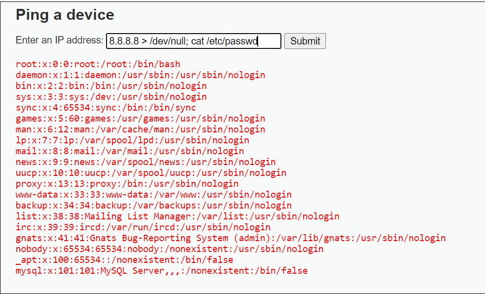

# Web Application Firewall

## Содержание

- [Запуск сервиса и подготовка к работе](#Подготовка)
- [Обнаруженные уязвимостей](#Уязвимости)
- [Использование Web Aplication Firewall](#WAF)

## Выполнение работы

### Подготовка

В первую очередь запускаем инфраструктуру

```
docker-compose up -d
```

Теперь на 80 порту слушается наш сервис. При переходе на страницу мы можем авторизироваться с помощью следующих данных:

```
login: admin
password: password
```

После этого мотаем вниз страницы и нажимаем кнопку Create/Reset Database и снова проходим авторизацию с теми же данными:


Отлично, теперь мы можем перейти к обнаружению уязвимостей данного веб-приложения

### Уязвимости

#### Brute Force 

**Брутфорс (от англ. brute force — грубая сила)** - метод угадывания пароля (или ключа, используемого для шифрования), предполагающий систематический перебор всех возможных комбинаций символов до тех пор, пока не будет найдена правильная комбинация.

#### Command injection

Используем следующую команду для просмотра всех пользователей в системе:

```
8.8.8.8 > /dev/null; cat /etc/passwd
```



Как видим, мы можем выполнить любую команду после ';' вплоть до удаления системы. Рекомендации по защите от уязвимости:

- **Использовать WAF**
- **Фильтровать входные значения**
- **Отказаться от использования функции exec()**
- **Фильтровать входные значения**

#### CSRF

**CSRF (англ. cross-site request forgery — «межсайтовая подделка запроса», также известна как XSRF)** — вид атак на посетителей веб-сайтов, использующий недостатки протокола HTTP. Если жертва заходит на сайт, созданный злоумышленником, от её лица тайно отправляется запрос на другой сервер (например, на сервер платёжной системы), осуществляющий некую вредоносную операцию (например, перевод денег на счёт злоумышленника). Для осуществления данной атаки жертва должна быть аутентифицирована на том сервере, на который отправляется запрос, и этот запрос не должен требовать какого-либо подтверждения со стороны пользователя, которое не может быть проигнорировано или подделано атакующим скриптом.

#### File Inclusion

Вставим в адрессную строку следующую команду для просмотра всех пользователей в системе:

```
http://your.ip/vulnerabilities/fi/?page=/etc/passwd
```


Как видим, мы можем вставить любой путь после '='. Рекомендации по защите от уязвимости:

- **Использовать WAF**
- **Добавить проверку на выход за пределы файловой системы сайта, то есть не давать подниматься выше корня сайта**

#### SQL Injection

С помощью union-based инъекций вытащим название таблицы пользователей, а затем данные для аутентификации:

```
1' union select table_name, table_schema from INFORMATION_SCHEMA.tables where table_type = 'BASE TABLE' -- -
```


```
1' union select user,password from users -- -
```


Для защиты от sql инъекций можно использовать следующие способы:

- **Использование WAF**
- **Экранирование символов в запросе**
- **Фильтрация введенного текста по блеклисту ключевых слов для SQL запросов**

#### XSS

**XSS (англ. Cross-Site Scripting — «межсайтовый скриптинг»)** — тип атаки на веб-системы, заключающийся во внедрении в выдаваемую веб-системой страницу вредоносного кода (который будет выполнен на компьютере пользователя при открытии им этой страницы) и взаимодействии этого кода с веб-сервером злоумышленника.

Введём в строку и отправим следующий запрос:

```

```


Рекомендации по защите вебсервера:

- **Использовать WAF**
- **Запретить использовать html/js код в формах ввода**

### WAF

Для защиты сервиса в файл custom/rules.conf впишем следующие правила:

```
SecRule ARGS "@contains ;" "phase:2,log,deny,msg:'Command injection'id:7000009" 
SecRule ARGS "@contains &&" "phase:2,log,deny,msg:'Command injection'id:700010" 
SecRule ARGS "@contains pwd" "phase:2,log,deny,msg:'Command injection'id:700011"
SecRule ARGS "@contains cat" "phase:2,log,deny,msg:'Command injection'id:700012"
SecRule ARGS "@contains etc" "phase:2,log,deny,msg:'File Inclusion'id:700013"
SecRule ARGS "@contains 'union'" "phase:2,log,deny,msg:'SQL injection'id:700014"
SecRule ARGS "@contains alert(" "phase:2,log,deny,msg:'XSS_Reflected'id:700015"
```

Проверим защиту вебсервиса с помощью скрипта exploration.py:


### Вывод

Важно понимать, что WAF не является панацеей, однако может быть отличным временным решеним. Конечно же описанные выше правила можно улучшить, заменить, сократить, однако я посчитал, что этих правил достаточно для защиты. 
