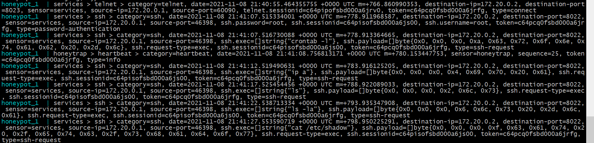

# Deception Technology

### Содержание:

- [Запуск сервиса и подготовка к работе](#Подготовка)
- [Просмотр и анализ логов](#Логи)
- [Обнаруженные уязвимостей](#Уязвимости)
- [Вывод](#Вывод)

### Выполнение работы

#### Подготовка

В первую очередь запускаем сервис Honeypot

```
cd /path/to/honeypot
docker-compose up
```

Эмулируем действия хакеров с помощью скрипта

```
chmod +x hackersActivity
./hackersActivity
```

#### Логи

Теперь смотрим, чем занимается скрипт. Для этого открываем логи honeypot:



Здесь мы можем наблюдать действия злоумышленника. Самые важные части логов:

```
date - время когда было произведено действие

category - категория сервиса (пример:ftp)

source-ip - ip-адрес с которого было произведено действие

command/exec - команда, которая была выполнена злоумышленником
```


С помощью этих логов мы узнаем о действиях злоумышленника и можем анализировать, какую опасность представляет то или иное действие

#### Уязвимости

Просканировав машину с помощью сервиса nmap обнаружили, что открыто несколько портов с сервисами:

- 8022 ssh
- 8023 telnet
- 8080 http 
- 8021 ftp
- 6379 redis

Проанализируем действия злоумышленников по каждому из сервисов по следующему шаблону:

```
Название сервиса
	Команда
		Что делает эта команда
		Что можно получить с помощью этой команды
		Какой ущерб может нанести эта команда
```

- ssh
  - Установка соединения
  	- Устанавливает ssh соединение 
  	- Несанкционированный доступ к машине
  	- Копирование/изменение/удаление информации, установка вредоносного по
  - ssh.exec=[]string{"ls"}
  	- Просмотр имеющихся файлов в текущей дириктории
  	- Название всех существующих файлов в текущей дириктории
  	- Копирование/изменение/удаление информации, содержащейся в файлах
  - ssh.exec=[]string{"ip a"}
  	- Просмотр информации об ip на интерфейсах машины
  	- IPv4 и IPv6 машины, подключенные сети, гейтвеи подключенных сетей
  	- Проникновение в закрытую инфраструктуру по ip
  - ssh.exec=[]string{"ss -tunlp"}
    - Просмотр занятых портов, названий и PID процессов, использующих эти порты
    - Порты, названия и PID
    - Предоставление злоумышленнику дополнительных уязвимостей для дальнейшего хаккинга
  - ssh.exec=[]string{"whoami}
  	- Просмотр текущего пользователя
  	- Имя пользователя, под которым злоумышленник проник в систему
  	- Злоумышленник может узнать, сколько у него прав и в зависимости от этого нанести максимальный ущерб системе
  - ssh.exec=[]string{"cat /etc/shadow"} или ssh.exec=[]string{"cat /etc/passwd"}
    - Просмотр существующих пользователей
    - Список пользователей и групп
    - Предоставление злоумышленнику дополнительных уязвимостей для дальнейшего хаккинга
  - ssh.exec=[]string{"crontab -l"}
  	- Просмотр существующих задач, выполняющихся по таймеру
  	- Список задач по таймеру
  	- Злоумышленник может узнать назначение машины и помешать/остановить работу важного сервиса

- telnet
	- Установка соединения
	  - Устанавливает telnet соединение 
	  - Несанкционированный доступ к машине
	  - Злоумышленник может получить информацию о корпоративной/виртуальной частной сети
	- display arp
	  - Просмотр arp таблицы машины
	  - Адреса машин внутри корпоративной/виртуальной частной сети
	  - Взлом других машин в сети
	- display session limit vpn-instance vpna
		- Просмотр лимита подключений через VPN
		- Состояние лимита (включен/выключен) и максимально количество подключений
		- Злоумышленник может узнать лимит подключений, что повлечет за собой возможность примерно определить количество машин, общающихся с текущей, а так же возможность DOS-атаки

- ftp
	- Установка соединения
	  - Устанавливает ftp соединение 
	  - Несанкционированный доступ к машине
	  - Копирование/Удаление/"Подкладывание" файлов
	- APPE filename
		- Отправляет файл на сервер, добаляя данные в конец файла, если он существует, или создавая новый
		- "Подкладывание" вредоносного файла/скрипта
		- Заражение машины вирусом
	- STOR filename
		- Отправляет файл на сервер, заменяя файл, если он существует, или создавая новый
		- "Подкладывание" вредоносного файла/скрипта
		- Заражение машины вирусом
	- PWD
		- Просмотр текущей дириктории
		- Информация о текущей дириктории
		- Возможность понять древо файловой системы.
	- LIST
		- Просмотр файлов в текущей дириктории
		- Информация о файлах в текущей дириктории
		- Злоумышленник получает возможность подложить вредоносные строки в существуюшие скрипты с помощью APPE

- http
	- Установка соединения
	  - Устанавливает http соединение 
	  - Несанкционированный доступ к машине
	  - Копирование/Просмотр файлов с помощью http протокола

	Злоумышленник просматривает архитектуру сайта с помощью просмотра файла sitemap.xml, а затем может просматривать файлы, вроде /etc/passwd или phpinfo.php для поиска уязвимостей и дальнейшего взлома

- redis
	- Установка соединения
	  - Устанавливает соединение c redis
	  - Несанкционированный доступ к машине
	  - Копирование/Просмотр информации в бд redis для поиска уязвимостей и дальнейшего взлома

#### Вывод

Honeypot - хорошая утилита для проверки машины на наличие уязвимостей и проверки интереса к ней хаккеров, а так же для улучшения системы безопасности благодаря полученным данным
