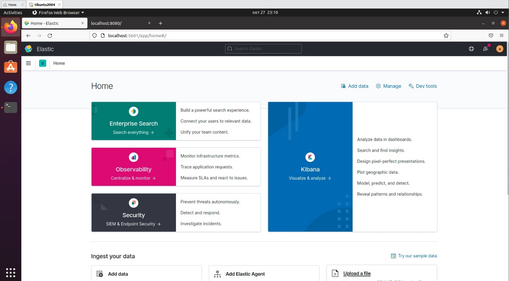
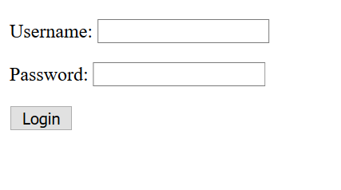
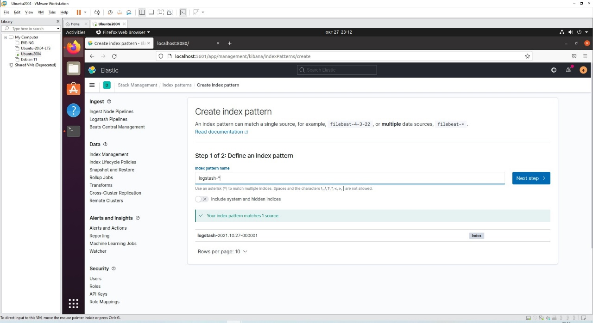
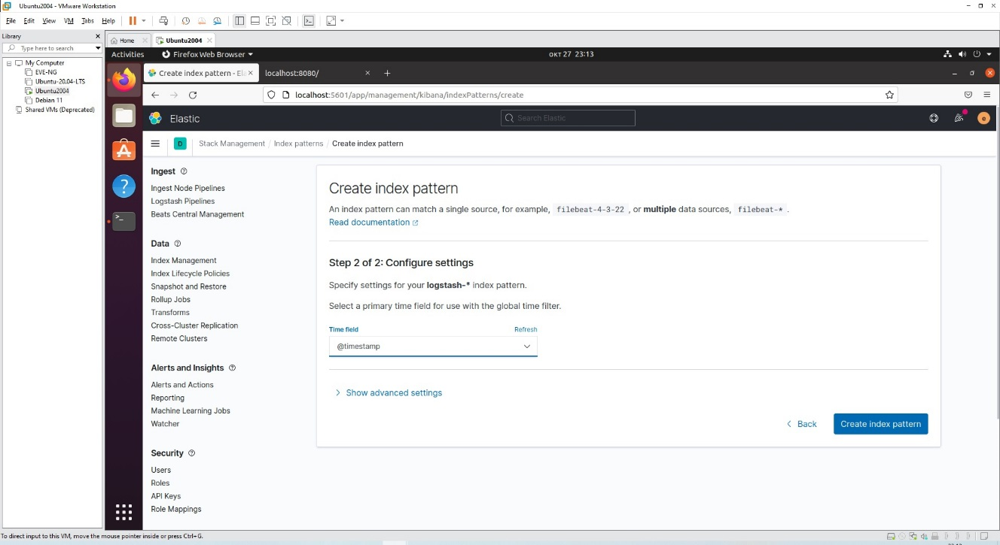
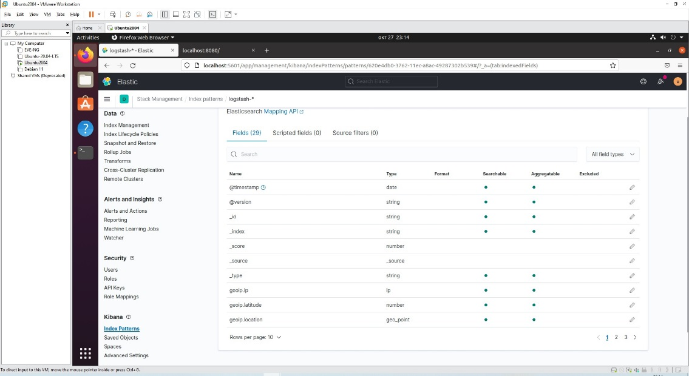
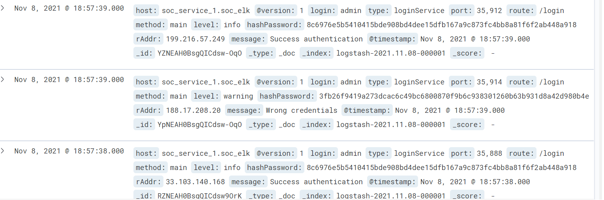
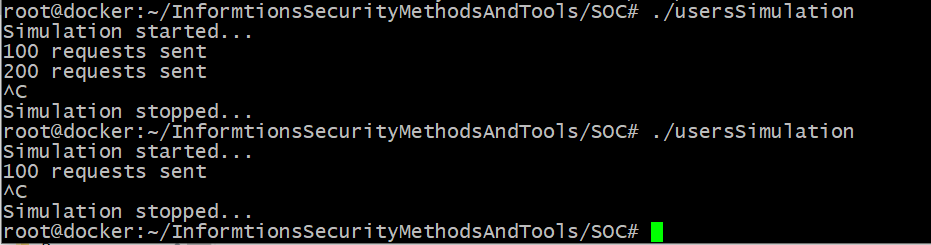
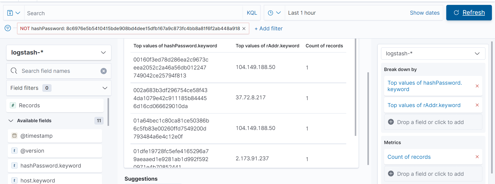
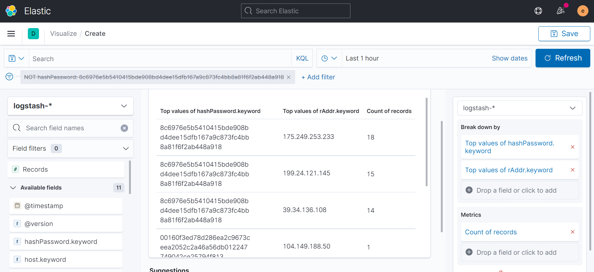

# Security Operations Center

### Содержание:

- [Запуск сервисов и подготовка к работе](#Подготовка)
- [Создание индекса](#Индекс)
- [Просмотр логов запросов](#Запросы)
- [Настройка визуализации](#Визуализация)

#### Подготовка

В первую очередь запускаем ELK-стек:

```
docker-compose up -d elasticsearch logstash kibana
```

После того как ELK-стек запустился, надо запустить сервис с формой ввода логина и пароля:

```
docker-compose up -d service
```

Теперь, когда все развернуто и готово к использованию, заходим в Kibana по адресу http://localhost:5601

```
login: elastic
password: changeme
```

Перед нами открывается вот такой интерфейс:



Теперь переходим по адресу http://localhost:8080 и создаем активность на странице авторизации:



Данные для успешной аутентификации:

```
login: admin
password: admin
```

#### Индекс

Теперь наша задача – проверить, записались ли логи. Для этого создаем индекс с определенной маской. Выбираем в левом меню Stack Management, а затем Index patterns и создаем новый паттерн с маской logstash-* и 'TimeField' @timestamp








#### Запросы

После создания модуля мы получаем доступ к данным. Обратимся к модулю Discover:



Здесь мы видим наши запросы с определнными параметрами. Вот самые важные из них:

```
@timestamp - Время попытки авторизации

rAddr - IP адрес с которого был отправлен запрос

login - Введённые логи

hashPassword - Хэшированный пароль

route - URL сервера к которому был отправлен запрос

message - Сообщение сервиса

level - тип сообщений (warning, info)
```

Генерируем данные для дальнейшего анализа с помощью приложения:

```
./usersSimulation
```

В результате генерации было отправлено 300 запросов:



#### Визуализация

Теперь будем анализировать информацию с помощью средств визуализации. Заходим в Dashbord и создаем новую визуализацию. Выбираем нужные параметры для удобного обслуживания и создаем фильтр, помогающий отсеить успешные аутентификации:



Здесь мы наблюдаем, что только 5 запросов были неуспешными, так же мы можем сразу видеть ip злоумышленников. При отключении фильтра наблюдаем все попытки аутентификации:


